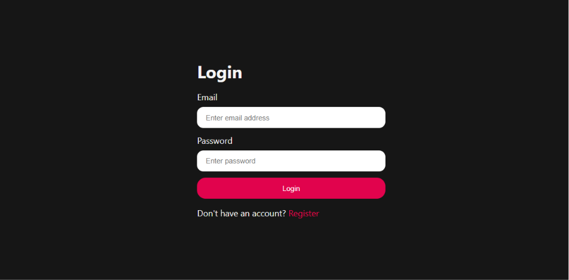
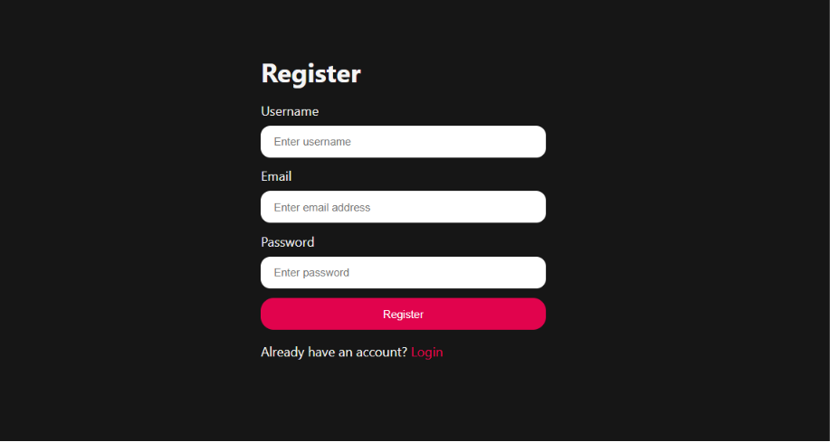
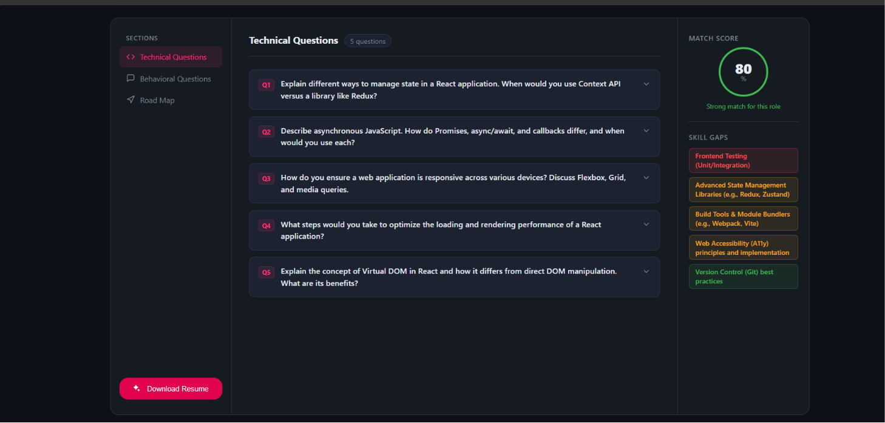
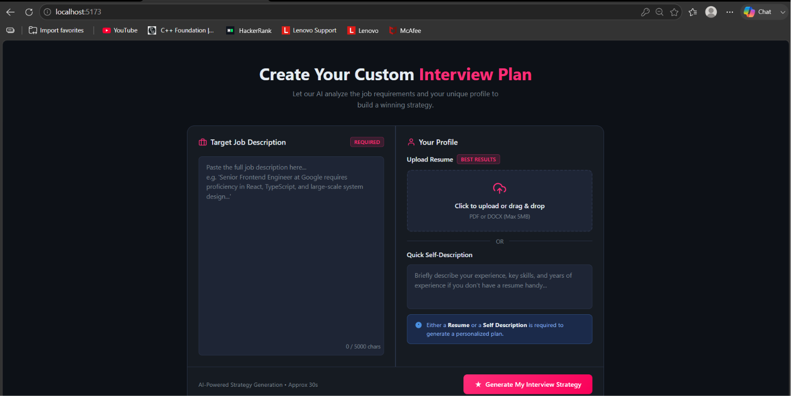
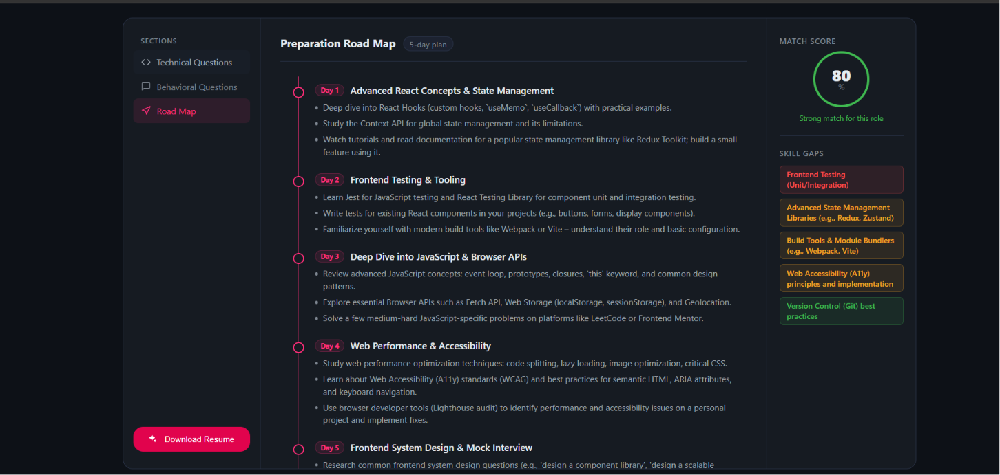

# 🚀 AI Interview Preparation Platform

An AI-powered full-stack interview preparation platform that helps job seekers prepare for interviews by analyzing their resumes and job descriptions. The platform generates personalized interview reports, technical & behavioral interview questions, skill gap analysis, and a 7-day preparation roadmap using Google Gemini AI.

---

## 🌐 Live Demo

**Frontend:https://ai-interview-preparation-platform-hazel.vercel.app/login
**Backend API:https://ai-interview-backend-gz7b.onrender.com

---

## ✨ Features

- 🔐 Secure JWT Authentication (Register & Login)
- 📄 Upload Resume (PDF)
- 🤖 AI-Powered Resume Analysis
- 🎯 Job Match Score
- 💡 AI-Generated Technical Interview Questions
- 💬 AI-Generated Behavioral Interview Questions
- 📊 Skill Gap Analysis
- 🗓️ Personalized 7-Day Interview Preparation Roadmap
- 📑 ATS-Friendly Resume PDF Generation
- 📱 Fully Responsive User Interface

---

## 📸 Screenshots

### 🔐 Login Page



---

### 📝 Register Page



---

### 📄 Resume Upload



---

### 🤖 AI Interview Report



---

### 🗓️ 7-Day Preparation Roadmap



---

# 🛠️ Tech Stack

## Frontend

- React.js
- React Router
- Axios
- CSS3

## Backend

- Node.js
- Express.js
- JWT Authentication
- Multer
- PDF-Parse

## Database

- MongoDB
- Mongoose

## AI

## AI

- Google Gemini AI
- Prompt Engineering

## Tools

## Tools

- Puppeteer
- Git
- GitHub
- Vercel
- Render
---

# 📂 Project Structure

```
AI-Interview-Preparation-Platform
│
├── backend
│   ├── src
│   │   ├── controllers
│   │   ├── middlewares
│   │   ├── models
│   │   ├── routes
│   │   └── services
│   ├── server.js
│   └── package.json
│
├── frontend
│
├── screenshots
│   ├── login.png
│   ├── register.png
│   ├── resume-upload.png
│   ├── interview-report.png
│   └── roadmap.png
│
└── README.md
```

---

# ⚙️ Installation

## 1. Clone Repository

```bash
git clone https://github.com/your-username/AI-Interview-Preparation-Platform.git
```

```bash
cd AI-Interview-Preparation-Platform
```

---

## 2. Backend Setup

```bash
cd backend
npm install
```

Create a `.env` file inside the backend folder.

```env
PORT=3000

MONGODB_URI=your_mongodb_connection_string

JWT_SECRET=your_jwt_secret

GOOGLE_GENAI_API_KEY=your_google_gemini_api_key
```

Start Backend

```bash
npm run dev
```

---

## 3. Frontend Setup

```bash
cd frontend
npm install
```

Create a `.env` file

```env
VITE_API_BASE_URL=http://localhost:3000
```

Run Frontend

```bash
npm run dev
```

---

# 🚀 Workflow

```
User Login/Register
        │
        ▼
Upload Resume (PDF)
        │
        ▼
Extract Resume Content
(pdf-parse)
        │
        ▼
Google Gemini AI
        │
        ▼
Generate Interview Report
        │
 ┌──────────────┬───────────────┬──────────────┐
 │              │               │              │
 ▼              ▼               ▼              ▼
Match Score  Technical Qs  Behavioral Qs  Skill Gaps
                        │
                        ▼
            7-Day Preparation Roadmap
                        │
                        ▼
            Generate Resume PDF
```

---

# 🔮 Future Improvements

- 🎙️ AI Voice Interview
- 📊 Interview History Dashboard
- 💻 Coding Interview Practice
- 🤖 AI Answer Evaluation & Feedback
- 📈 Dashboard Analytics
- 🌙 Light/Dark Theme
- 📧 Email Interview Reports

---

# 🤝 Contributing

Contributions are welcome!

1. Fork the repository
2. Create a feature branch
3. Commit your changes
4. Push to your branch
5. Open a Pull Request

---

# 👨‍💻 Author

**Ankit Rawat**

- GitHub: https://github.com/Ankit1903-eng
- LinkedIn: https://www.linkedin.com/in/ankitmyskill/

---

# ⭐ Support

If you found this project useful, consider giving it a ⭐ on GitHub.

---
